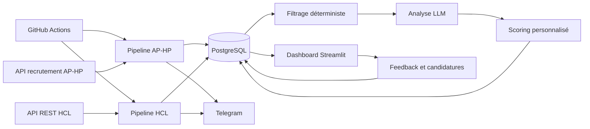

# Hospital Job Watch — AP-HP & HCL

[](https://github.com/nailito/aphp-job-bot/actions/workflows/ci.yml)

Outil personnel de veille qui collecte, normalise et priorise les offres d'emploi publiées par
l'AP-HP et les Hospices Civils de Lyon.

> A multi-source Python pipeline combining PostgreSQL, deterministic rules, LLM-assisted
> ranking and a Streamlit dashboard.

Le projet remplace une veille manuelle fragmentée par un système d'aide à la décision
inspectable. Il suit le cycle de vie des offres, écarte les incompatibilités explicites, analyse
les cas ambigus et centralise le retour utilisateur. **Aucune candidature n'est envoyée
automatiquement.**

## Fonctionnalités

- collecte de deux sources publiques hétérogènes et normalisation de leurs données ;
- upsert PostgreSQL et suivi des offres nouvelles, retirées ou réactivées ;
- filtrage hybride : règles déterministes, puis LLM pour les cas ambigus ;
- scoring personnalisé avec priorité, justification et points de vigilance ;
- dashboard Streamlit pour explorer les offres, donner du feedback et suivre les candidatures ;
- exécutions planifiées avec GitHub Actions et notifications Telegram facultatives ;
- garde-fous contre les collectes incomplètes et tests sur données synthétiques.

## Architecture



| Domaine | Technologies |
|---|---|
| Collecte | Python, Requests, Beautiful Soup |
| Données | PostgreSQL, psycopg |
| Analyse | Règles métier, API Groq, sorties JSON structurées |
| Interface | Streamlit, Pandas, Plotly |
| Automatisation | GitHub Actions, Telegram Bot API |

Voir [l'architecture détaillée](docs/architecture.md) pour le cycle de vie des offres,
la reprise sur erreur et les limites du système.

## Installation locale

### Prérequis

- Python 3.11 ou plus récent ;
- PostgreSQL ;
- une clé Groq pour le filtrage et le scoring LLM.

```bash
git clone https://github.com/nailito/aphp-job-bot.git
cd aphp-job-bot

python -m venv .venv
source .venv/bin/activate
python -m pip install -r requirements.txt
```

Créez ensuite la configuration et deux profils locaux ignorés par Git :

```bash
cp .env.example .env
mkdir -p .local
cp examples/profile_factuel.example.md .local/profile_factuel.md
cp examples/profile_motivationnel.example.md .local/profile_motivationnel.md
```

Renseignez au minimum `DATABASE_URL`, `GROQ_API_KEY` et `DASHBOARD_PASSWORD` dans `.env`,
puis personnalisez les deux fichiers Markdown sous `.local/`. Le profil peut aussi être injecté
directement avec les variables `PROFILE_FACTUEL` et `PROFILE_MOTIVATIONNEL`, notamment dans
GitHub Actions.

Chargez les variables et initialisez le schéma :

```bash
set -a
source .env
set +a
# Si la base locale n'existe pas encore (PostgreSQL doit être démarré) :
createdb job_bot
python -m scripts.init_db
```

## Utilisation

Pour une base distante, configurez le chiffrement dans `DATABASE_URL` (par exemple
`?sslmode=require`). Les paramètres de connexion de l'URL sont conservés tels quels.

```bash
# Collecte, filtrage et scoring AP-HP
python pipeline_aphp.py

# Collecte, filtrage et scoring HCL
python pipeline_hcl.py

# Interface privée
streamlit run dashboard.py
```

Le workflow [`.github/workflows/daily.yml`](.github/workflows/daily.yml) peut aussi lancer les
deux pipelines à heures fixes ou manuellement. Les expressions cron de GitHub Actions sont en
UTC. Chaque pipeline est exécuté même si l'autre échoue, mais le workflow global devient rouge
dès qu'un des deux échoue.

Les analyses restées en attente sont reprises lors des exécutions suivantes, même sans nouvelle
offre. Une collecte incomplète n'est pas utilisée pour retirer des offres de la base. Un quota
LLM épuisé ou une erreur de traitement rend l'exécution incomplète et le workflow échoue.

### Configuration GitHub Actions

Dans les secrets du dépôt, configurez `DATABASE_URL`, `GROQ_API_KEY`, `PROFILE_FACTUEL` et
`PROFILE_MOTIVATIONNEL`. Les variables Telegram de `.env.example` sont facultatives.
`DASHBOARD_PASSWORD` est nécessaire seulement sur l'hôte du dashboard.

Le bouton de déclenchement manuel du dashboard est facultatif : il utilise `GH_WORKFLOW_TOKEN`,
un jeton limité à l'accès Actions nécessaire sur votre dépôt, et `GH_WORKFLOW_REPOSITORY`
au format `compte/depot`. `GH_WORKFLOW_REF` vaut `main` par défaut. Sans ces paramètres,
utilisez directement l'onglet Actions de GitHub.

## Structure du dépôt

```text
.
├── pipeline_aphp.py       # orchestration AP-HP
├── pipeline_hcl.py        # orchestration HCL
├── scraper_*.py           # collecte et normalisation
├── filter_*.py            # règles et filtre LLM
├── scorer_*.py            # scoring personnalisé
├── database_*.py          # accès PostgreSQL
├── dashboard.py           # interface Streamlit protégée par mot de passe
├── sql/schema.sql         # schéma reproductible
├── scripts/init_db.py     # initialisation de la base
├── examples/              # profils synthétiques
├── docs/architecture.md   # choix techniques et limites
└── tests/                 # tests sans réseau ni données personnelles
```

## Qualité et tests

```bash
python -m pip install -r requirements-dev.txt
ruff check .
pytest
```

La CI exécute ces vérifications à chaque push et pull request.

## Données, confidentialité et sécurité

- Les profils, feedbacks, candidatures, bases, exports et logs ne doivent jamais être versionnés.
- Le dashboard contient des données personnelles : ne l'exposez pas sans mot de passe, TLS et
  contrôle d'accès réseau approprié.
- Quand l'analyse LLM est activée, des extraits d'offres et les critères du profil sont transmis
  au fournisseur configuré, ainsi que certains feedbacks. Ne fournissez que les informations
  strictement nécessaires.
- Le contenu d'une offre est traité comme une donnée non fiable ; les sorties du modèle restent
  une aide à la priorisation, jamais une décision objective de recrutement.
- Les captures destinées à un portfolio doivent utiliser uniquement des données synthétiques et
  ne contenir ni logo tiers, ni contact, ni identifiant de base.

## Limites et avertissement

Les endpoints sources peuvent changer et le scoring LLM peut varier. Les règles actuelles
ciblent surtout un profil ingénieur généraliste Bac+5 : adapter uniquement le profil privé ne
suffit pas à cibler un autre métier ; relisez aussi `config.py` et les règles/prompts des
`filter_*.py`. Il convient de vérifier les conditions d'utilisation, de limiter la fréquence des
requêtes et de garder une validation humaine.

Les tests automatisés utilisent des doublures de services : ils ne remplacent pas un test
d'intégration sur une base PostgreSQL dédiée et avec les fournisseurs externes. Le schéma permet
une installation neuve ; une ancienne base doit être sauvegardée et comparée au schéma avant
migration. Aucune migration destructive des données n'est exécutée automatiquement.

Ce projet n'est ni affilié, ni approuvé, ni maintenu par l'Assistance Publique – Hôpitaux de Paris
ou les Hospices Civils de Lyon. Les noms, marques et contenus des plateformes sources restent la
propriété de leurs titulaires respectifs :
[recrutement AP-HP](https://recrutement.aphp.fr/) et
[recrutement HCL](https://chu-lyon.nous-recrutons.fr/).
